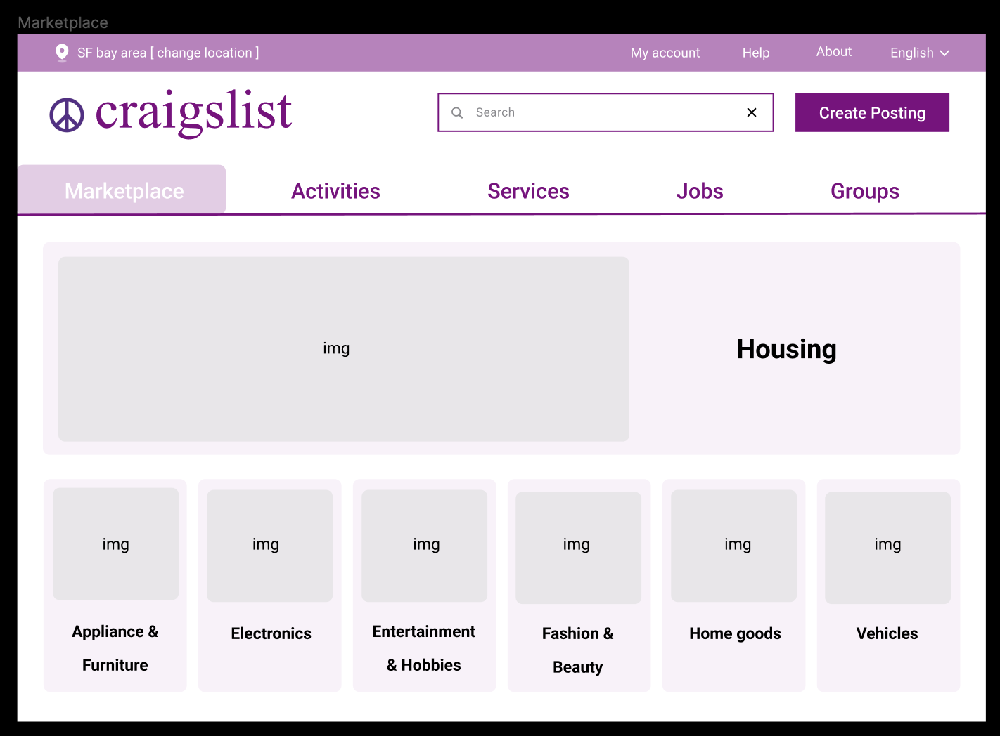
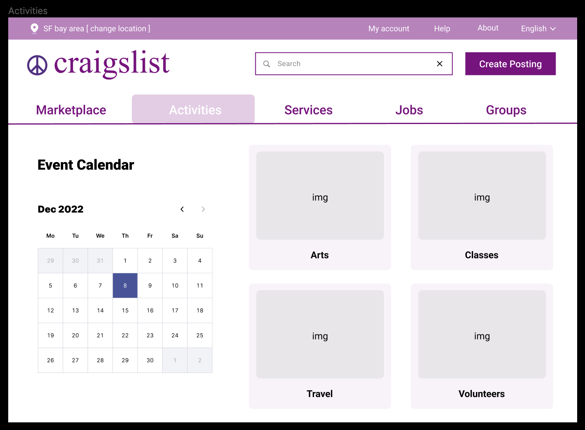
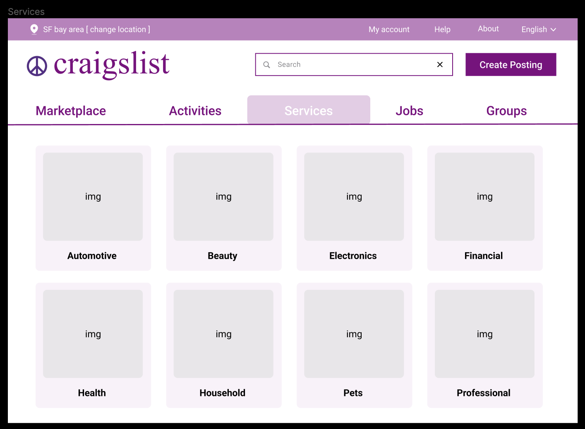
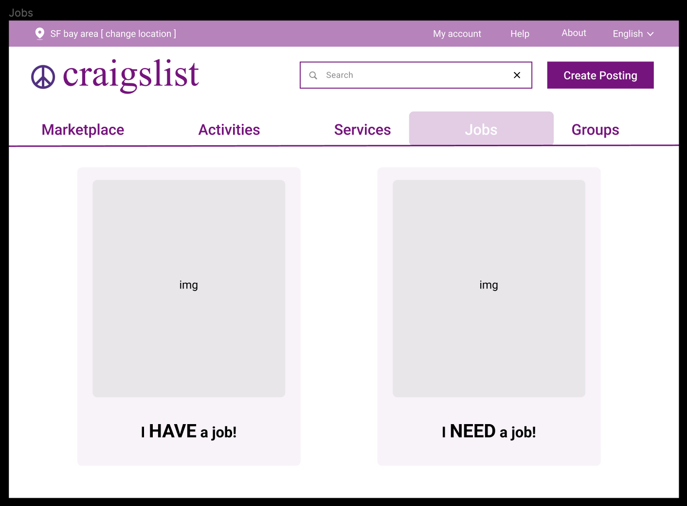
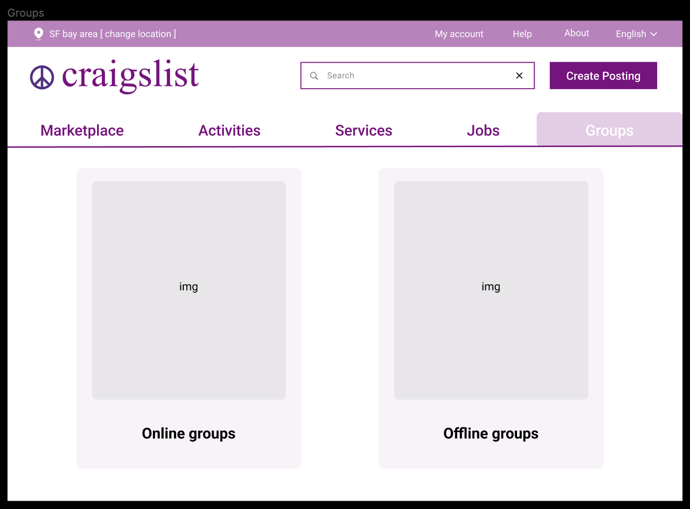

# Reorganize Craigslist

## Project Type
Implementation project

## Deliverable
Please find the web page here: https://gitcatmeoww.github.io/craigslist-deploy/

## Writeup
This project is inspired by the general concept of **“information architecture”**, which advocates organizing and structuring information to aid navigation and search. 

[Craigslist](https://sfbay.craigslist.org/), a famous website with extensive and versatile local resources, should have helped people make better sense of the world around them. However, in my opinion, it fails to make best use of these valuable assets because it is poorly organized and presented. 

Thus, this project aims to better structure craigslist following the main steps of information architecture design. 

> *User Understanding - Content Organizing - Context analysis - Technical Implementation*

First, I started with understanding **users’ information-seeking needs** on Craigslist. I conducted five in-depth interviews with users of different length and frequency in their use of Craigslist. After collating, analyzing, and synthesizing all the qualitative data, I was surprised to find that user needs on Craigslist falls perfectly into the types of information needs referred to in class, that is:
> 1. **Transactions:** The most common need, under which Craigslist works like an online marketplace for users to sell and buy anything.
> 2. **Fact finding:** Such as finding events on a particular day, or searching for a specific service in the nearby locality.
> 3. **Information gathering:** Generates especially when users are in need of information regarding houses and jobs.
> 4. **Browsing:** The least common need, users browse Craigslist for fun, broadening knowledge, or connecting with people near them.

After having a clear idea of user needs on Craigslist, I turned to the **“content”** part in information architecture, trying to map the resources on Craigslist with the above mentioned user needs and make intentional arrangements:
> 1. **Resources:** The main resource on Craigslist is every user posting.
> 2. **Selection policy:** Based on comprehensiveness, which means every existing posting on Craigslist will be selected.
> 3. **Organization:** As mentioned above, structure available resources by users’ information-seeking needs on Craigslist. Specifically, in terms of categories in the organization step, I adopted individually-created categories and combined hierarchical categories with faceted categories, in order to better satisfy different user needs.
> 4. **Interactions:** Log in, register, search, browse, post, reply, add to favorite, filter, sort, etc.

Lastly, before the implementation, the **“context”** part also must be taken into account. Constrained by Craigslist’s data protection, every user posting can not be obtained. Thus, the technical implementation will be focused on reorganizing and restructuring the information on Craigslist’s homepage. As you can see the prototype design below:

